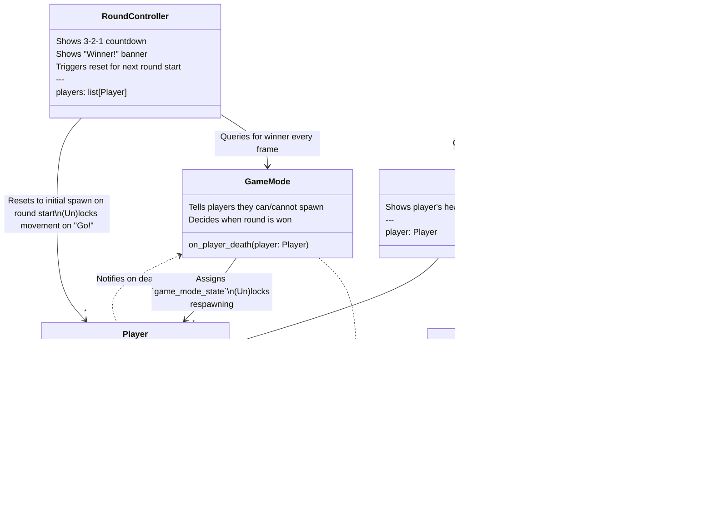
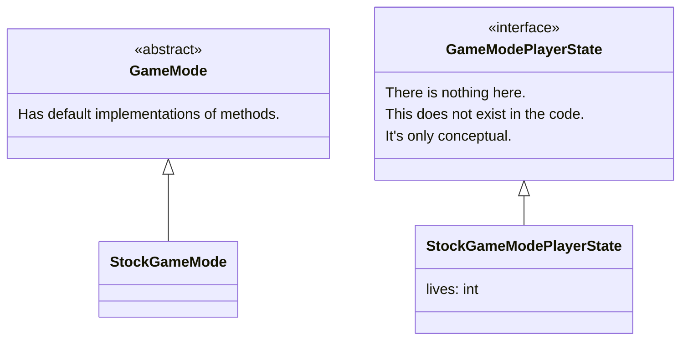

```mermaid
classDiagram

note "NOTE:
This diagram depicts
Stock-specific subclasses
of `GameMode` and `GameModePlayerState`.
This is why it shows `lives`,
even though players do not necessarily
have lives in all modes.
"

GameMode <.. Player : Notifies on death

GameMode --> "*" Player : Assigns `game_mode_state`\n(Un)locks respawning
RoundController --> "*" Player : Resets to initial spawn on round start\n(Un)locks movement on "Go!"
RoundController --> GameMode : Queries for winner every frame
GameMode .. "*" GameModePlayerState : Creates one per player\nMutates during gameplay
Player <--> Vehicle
Player *--> GameModePlayerState
Hud o--> "*" PlayerHud : One per player
PlayerHud --> Player
PlayerHud o--> LivesHud : Created conditionally if `player.game_mode_state` has lives
LivesHud --> GameModePlayerState

class PlayerHud {
    Shows player's health, icon, & respawn timer.
    ---
    player: Player
}

class LivesHud {
    Shows heart icons for lives
    ---
    player_state: GameModePlayerState
}

class RoundController {
    Shows 3-2-1 countdown
    Shows "Winner!" banner
    Triggers reset for next round start
    ---
    players: list[Player]
}
class GameMode {
    Tells players they can/cannot spawn
    Decides when round is won
    on_player_death(player: Player)
}

class GameModePlayerState {
    lives: int
}

class Player {
    controls_active: bool
    allowed_to_respawn: bool
    game_mode_state: GameModePlayerState
    round_start_spawn()
}

```

---

```mermaid
classDiagram
GameMode <|-- StockGameMode
GameModePlayerState <|-- StockGameModePlayerState
class GameMode {
    <<abstract>>
    Has default implementations of methods.
}
class GameModePlayerState {
    <<interface>>
    There is nothing here.
    This does not exist in the code.
    It's only conceptual.
}
class StockGameModePlayerState {
    lives: int
}
```